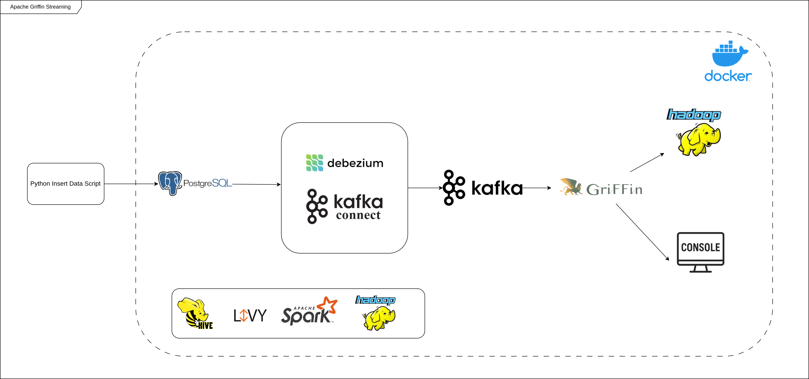

# Griffin Seminar

## Overview

This project is a seminar project for the course "INTRODUCTION TO BIG DATA ANALYSIS" at the University of Science - VNUHCM. The project focuses on data quality measurement using Apache Griffin, a data quality solution for big data.
The project includes both batch and streaming data quality measurement using Griffin. The batch measurement uses a CSV file as the data source, while the streaming measurement uses a PostgreSQL database as the data source. The project also includes the use of Apache Kafka for data streaming and Apache Hive for data storage.

## Installation

### Prerequisites

- Apache Hadoop (2.7.3)
- Apache Spark (2.2.0)
- Apache Hive (2.3.0)
- Apache Griffin (0.6.0)
- Apache Livy (0.4.0)
- Java 8
- JDK (1.8+)
- Docker & Docker Compose

### Setup

1. Add the following lines to your `/etc/hosts` file:

```bash
127.0.0.1 postgres
127.0.0.1 pgadmin
127.0.0.1 postgres
127.0.0.1 zk
127.0.0.1 kafka
127.0.0.1 es
127.0.0.1 griffin
127.0.0.1 griffin.api
```

2. Start docker compose

```bash
docker compose up -d
```

3. Set up the environment variables

```bash
export HADOOP_HOME=/home/khtn_22127286/hadoop-2.7.3
export HADOOP_INSTALL=$HADOOP_HOME
export HADOOP_MAPRED_HOME=$HADOOP_HOME
export HADOOP_COMMON_HOME=$HADOOP_HOME
export HADOOP_HDFS_HOME=$HADOOP_HOME
export YARN_HOME=$HADOOP_HOME
export HADOOP_COMMON_LIB_NATIVE_DIR=$HADOOP_HOME/lib/native
export PATH=$PATH:$HADOOP_HOME/sbin:$HADOOP_HOME/bin
export HADOOP_OPTS="-Djava.library.path=$HADOOP_HOME/lib/native"
export SPARK_HOME=/home/khtn_22127286/spark
export PATH=$PATH:$SPARK_HOME/bin:$SPARK_HOME/sbin
export PYSPARK_PYTHON=/usr/bin/python3
export HADOOP_CONF_DIR=$HADOOP_HOME/etc/hadoop
export LIVY_HOME=/home/khtn_22127286/livy
export PATH=$PATH:$LIVY_HOME/bin
export HIVE_HOME=/home/khtn_22127286/hive
export PATH=$PATH:$HIVE_HOME/bin
export HIVE_CONF_DIR=$HIVE_HOME/conf
export PATH=$PATH:$HIVE_HOME/bin
export CLASSPATH=$CLASSPATH:$HADOOP_HOME/lib/*:.
export CLASSPATH=$CLASSPATH:$HIVE_HOME/lib/*:.
export CLASSPATH=$CLASSPATH:$SPARK_HOME/jars/*:.
export CLASSPATH=$CLASSPATH:$LIVY_HOME/jars/*:.
```

4. Start Hadoop & YARN

```bash
start-dfs.sh
start-yarn.sh
```

5. Set up Apache Livy

- Download Apache Livy version 0.4.0 from [Apache Livy](https://archive.apache.org/dist/incubator/livy/0.4.0-incubating/livy-0.4.0-incubating-bin.zip)
- Unzip the downloaded file, copy the 'conf/livy.conf.template' file to 'conf/livy.conf' and edit the 'conf/livy.conf' file to set the following properties:

```bash
livy.server.host = 127.0.0.1
livy.server.port = 8998
livy.spark.master = yarn
livy.spark.deployMode = cluster
```

- Edit the `conf/livy-env.sh` file to set the following properties:

```bash
JAVA_HOME=/usr/lib/jvm/java-8-openjdk-amd64
HADOOP_CONF_DIR=$HADOOP_HOME/etc/hadoop
SPARK_HOME=/home/khtn_22127286/spark
SPARK_CONF_DIR=$SPARK_HOME/conf
```

- Start Apache Livy

```bash
livy-server start
```

6. Set up Apache Hive

- Download Apache Hive version 2.3.0 from [Apache Hive](https://archive.apache.org/dist/hive/hive-2.3.0/apache-hive-2.3.0-bin.tar.gz)
- Unzip the downloaded file, copy the 'conf/hive-env.sh.template' file to 'conf/hive-env.sh' and edit the 'conf/hive-env.sh' file to set the following properties:

```bash
export HADOOP_HOME=$HADOOP_HOME
```

- Copy the 'conf/hive-site.xml.template' file to 'conf/hive-site.xml' or form this site [hive-site.xml](https://github.com/apache/hive/blob/master/data/conf/hive-site.xml) and edit the 'conf/hive-site.xml' file to set the following properties:

```xml
<configuration>
    <property>
        <name>spark.yarn.jars</name>
        <value>hdfs://localhost:9000/home/spark_lib/*</value>
    </property>
    <property>
        <name>hive.exec.scratchdir</name>
        <value>/tmp/hive</value>
        <description>HDFS root scratch dir for Hive jobs which gets created with write all (733) permission. For each connecting user, an HDFS scratch dir: ${hive.exec.scratch>
    </property>
    <property>
        <name>hive.exec.local.scratchdir</name>
        <value>/tmp/hive</value>
        <description>Local scratch space for Hive jobs</description>
    </property>
    <property>
        <name>hive.downloaded.resources.dir</name>
        <value>/tmp/hive</value>
        <description>Temporary local directory for added resources in the remote file system.</description>
    </property>
    <property>
        <name>hive.metastore.warehouse.dir</name>
        <value>/user/hive/warehouse</value>
        <description>location of default database for the warehouse</description>
    </property>
    <property>
        <name>hive.metastore.uris</name>
        <value>thrift://localhost:9083</value>
        <description>Thrift URI for the remote metastore. Used by metastore client to connect to remote metastore.</description>
    </property>
    <property>
        <name>hive.metastore.port</name>
        <value>9083</value>
        <description>Hive metastore listener port</description>
    </property>
    <property>
        <name>javax.jdo.option.ConnectionPassword</name>
        <value>123456</value>
        <description>password to use against metastore database</description>
    </property>
    <property>
        <name>javax.jdo.option.ConnectionURL</name>
        <value>jdbc:postgresql://localhost:5432/quartz</value>
        <description>
        JDBC connect string for a JDBC metastore.
        To use SSL to encrypt/authenticate the connection, provide database-specific SSL flag in the connection URL.
        For example, jdbc:postgresql://myhost/db?ssl=true for postgres database.
        </description>
    </property>
    <property>
        <name>javax.jdo.option.ConnectionDriverName</name>
        <value>org.postgresql.Driver</value>
        <description>Driver class name for a JDBC metastore</description>
    </property>'
    <property>
        <name>javax.jdo.option.ConnectionUserName</name>
        <value>griffin</value>
        <description>Username to use against metastore database</description>
    </property>
    <property>
        <name>hive.querylog.location</name>
        <value>/tmp/hive</value>
        <description>Location of Hive run time structured log file</description>
    </property>
    <property>
        <name>hive.druid.metadata.db.type</name>
        <value>postgresql</value>
        <description>
        Expects one of the pattern in [mysql, postgresql].
        Type of the metadata database.
        </description>
    </property>
    <property>
        <name>hive.druid.metadata.uri</name>
        <value>jdbc:postgresql://localhost:5432/quartz</value>
        <description>URI to connect to the database (for example jdbc:mysql://hostname:port/DBName).</description>
    </property>
    <property>
        <name>hive.server2.logging.operation.log.location</name>
        <value>tmp/hive/operation_logs</value>
        <description>Top level directory where operation logs are stored if logging functionality is enabled</description>
    </property>
    <property>
        <name>hive.execution.engine</name>
        <value>spark</value>
        <description>
        Expects one of [mr, tez, spark].
        Chooses execution engine. Options are: mr (Map reduce, default), tez, spark. While MR
        remains the default engine for historical reasons, it is itself a historical engine
        and is deprecated in Hive 2 line. It may be removed without further warning.
        </description>
    </property>
    <property>
        <name>hive.server2.thrift.port</name>
        <value>10000</value>
        <description>Port number of HiveServer2 Thrift interface when hive.server2.transport.mode is 'binary'.</description>
    </property>
<configuration>
```

- Create directories for Hive

```bash
hdfs dfs -mkdir -p /user/hive/warehouse
hdfs dfs -mkdir -p /tmp/hive
```

- Start Apache Hive

```bash
# Initialize the metastore
schematool -dbType postgres -initSchema
# Check the schema
schematool -dbType postgres -info
# Start the metastore
hive --service hiveserver2
hive --service metastore
```

7. Set up Apache Spark

- Download Apache Spark version 2.2.0 from [Apache Spark](https://archive.apache.org/dist/spark/spark-2.2.0/spark-2.2.0-bin-hadoop2.7.tgz)
- Unzip the downloaded file, copy the 'conf/spark-env.sh.template' file to 'conf/spark-env.sh' and edit the 'conf/spark-env.sh' file to set the following properties:

```bash
# Memory settings
SPARK_DRIVER_MEMORY=4G
SPARK_EXECUTOR_MEMORY=2G

# Core settings
SPARK_WORKER_CORES=4

SPARK_MASTER_HOST=localhost
SPARK_MASTER_PORT=7077
SPARK_MASTER_WEBUI_PORT=8080

# Directory settings
SPARK_LOG_DIR=${SPARK_HOME}/logs
SPARK_WORKER_DIR=${SPARK_HOME}/work

export JAVA_HOME=/usr/lib/jvm/java-8-openjdk-amd64
export SPARK_SUBMIT_OPTS="-Dscala.usejavacp=true"
```

- Copy the 'conf/spark-defaults.conf.template' file to 'conf/spark-defaults.conf' and edit the 'conf/spark-defaults.conf' file to set the following properties:

```bash
spark.master                    yarn-cluster
spark.serializer                org.apache.spark.serializer.KryoSerializer
spark.yarn.jars                 hdfs://localhost:9000/home/spark_lib/*
spark.yarn.dist.files           hdfs://localhost:9000/home/spark_conf/hive-site.xml
spark.sql.broadcastTimeout  500
spark.yarn.principal            khtn_22127286
```

- Copy hive-site.xml to the Spark configuration directory

```bash
cp $HIVE_HOME/conf/hive-site.xml $SPARK_HOME/conf/
```

- Start Apache Spark

```bash
start-master.sh
start-slave.sh spark://localhost:7077
```

8. Upload the Hive libraries to HDFS

```bash
hdfs dfs -mkdir -p /home/spark_lib
hdfs dfs -put $HIVE_HOME/lib/* /home/spark_lib
hdfs dfs -put $SPARK_HOME/jars/* /home/spark_lib
```

9. Upload hive-site.xml to HDFS

```bash
hdfs dfs -mkdir -p /home/spark_conf
hdfs dfs -put $HIVE_HOME/conf/hive-site.xml /home/spark_conf
```

10. Set up Apache Griffin

- You can use the pre-built Griffin image from Docker Hub or build it from source.
- Pull the pre-built Griffin image from Docker Hub

```bash
docker pull namnguyen160504/griffin:0.6.0
```

- Build from source from [Apache Griffin](https://downloads.apache.org/griffin/0.6.0/griffin-0.6.0-source-release.zip), unzip the downloaded file, and edit the `ui/angular/src/environments/environment.ts` file to set the following properties:

```typescript
export const environment = {
  production: false,
  BACKEND_SERVER: "http://localhost:8080",
};
```

- Edit the `ui/angular/src/environments/environment.prod.ts` file to set the following properties:

```typescript
export const environment = {
  production: true,
  BACKEND_SERVER: "http://localhost:8080",
};
```

- And build Apache Griffin image

```bash
docker build -f Dockerfile.griffin -t namnguyen160504/griffin:0.6.0 .
```

- Run the Griffin container

```bash
./start.sh
```

- Access the Griffin web UI at [http://localhost:80](http://localhost:80)
- Move griffin-measure.jar and griffin-service.jar from the Docker container to the local machine

```bash
./cp.sh
```

11. Run the Griffin Service if you want to use the Griffin Service

```bash
java -jar griffin-service.jar
```

## Run Apache Griffin Measure

### Batch Mode

- Start the Hive CLI

```bash
hive
```

- Inside the Hive CLI, create the source table in the default database:

```sql
CREATE TABLE IF NOT EXISTS default.source (
    id STRING,
    user_id STRING,
    user_verified BOOLEAN,
    username STRING,
    url STRING,
    published_on STRING,
    text STRING,
    image_count INT,
    video_count INT,
    has_audio BOOLEAN
)
ROW FORMAT DELIMITED
FIELDS TERMINATED BY ','
STORED AS TEXTFILE
TBLPROPERTIES ('skip.header.line.count'='1');
```

- Exit Hive to upload file

```sql
quit;
```

- Upload the CSV file to HDFS

```bash
hdfs dfs -mkdir -p /user/hive/warehouse/source
hdfs dfs -put data.csv /user/hive/warehouse/source/
```

- Restart Hive

```bash
hive
```

- Inside the Hive CLI, load data into the source table:

```sql
LOAD DATA INPATH '/user/hive/warehouse/source/data.csv'
INTO TABLE default.source;
```

- Verify the data in the source table:

```sql
SELECT * FROM default.source LIMIT 10;
```

- Exit Hive

```sql
quit;
```

- Run the Griffin Measure

```bash
spark-submit --class org.apache.griffin.measure.Application --master yarn --deploy-mode client --queue default --driver-memory 1g --executor-memory 1g --num-executors 3 griffin-measure.jar env-batch.json dq-batch.json
```

- View the results

```bash
hdfs dfs -cat /griffin/batch/persist/batch_accu/*/_METRICS
```

### Streaming Mode
- Architecture



- Start Hive Metastore

```bash
hive --service metastore
```

- Navigate to pgadmin web UI at [http://localhost:5050](http://localhost:5050) and create a new table in the `quartz` database:

```sql
CREATE TABLE source (
    id VARCHAR(512) PRIMARY KEY,
    user_id VARCHAR(512),
    user_verified BOOL,
    username VARCHAR(512),
    url VARCHAR(512),
    published_on VARCHAR(512),
    text TEXT NULL,
    image_count INT NULL,
    video_count INT NULL,
    has_audio BOOL NULL
);
```

- Create Debezium connector for PostgreSQL

```bash
./start-source-connectors.sh
```

- Or use Postman to create the connector by sending a POST request to the Debezium connector at [http://localhost:8083/connectors](http://localhost:8083/connectors) with the following JSON body:

```json
{
  "name": "postgres-connector",
  "config": {
    "connector.class": "io.debezium.connector.postgresql.PostgresConnector",
    "database.hostname": "postgres",
    "database.port": "5432",
    "database.user": "griffin",
    "database.password": "123456",
    "database.dbname": "quartz",
    "database.server.name": "source",
    "schema.include.list": "public",
    "table.include.list": "public.source",
    "plugin.name": "pgoutput",
    "topic.prefix": "source"
  }
}
```

- Insert data into the `source` table using the following python script with data.csv file:

```bash
python insert_postgres.py
```

- Use kafka to consume data from the `source` table and produce it to the `source` topic:

```bash
python consume_and_produce.py
```

- Run the Griffin Measure

```bash
spark-submit --class org.apache.griffin.measure.Application --master yarn --deploy-mode client --queue default --driver-memory 1g --executor-memory 1g --num-executors 3 griffin-measure.jar env-streaming.json dq-streaming.json
```

- View the results

```bash
hdfs dfs -cat /griffin/streaming/persist/streaming_accu/*/_METRICS
```
